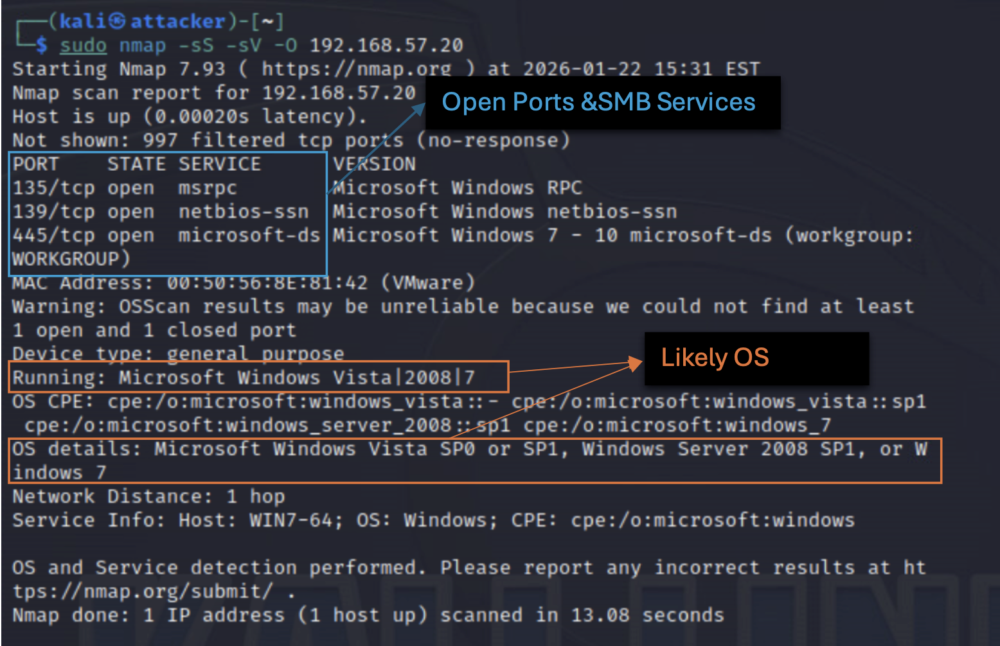
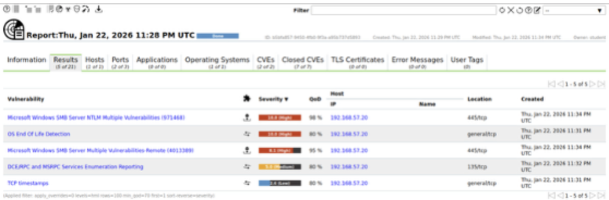

# Milestone 1: Network Scanning and Vulnerability Assessment

## 1. Overview

This milestone focused on identifying live hosts in the network and performing service enumeration to detect potential vulnerabilities. The analysis was carried out on a controlled lab network simulating a small enterprise environment..

---

## 2. Environment Setup and Tools
The assessment was conducted within a virtualized lab environment consisting of multiple virtual machines representing various network roles (firewall/router, Windows client, Linux client). 


### Virtual Machines (VMs)

| VM                  | Purpose                                                  |
|---------------------|----------------------------------------------------------|
| **Pentester**       | Kali Linux machine used for scanning and testing         |
| **Victim-Laptop**   | Host targeted during enumeration                         |
| **Application Server** | Runs DVWA and Mutillidae vulnerable apps             |

### Network Diagram


**Figure 1:** Network layout showing Pentester, Victim, and App Server*

### Login Credentials
#### Virtual Machines

| VM             | Username | Password    |
|----------------|----------|-------------|
| Pentester      | kali     | kali        |
| Victim-Laptop  | Student  | P@ssw0rd    |

#### Web Applications

| App       | URL                          | Username | Password  |
|-----------|------------------------------|----------|-----------|
| OpenVAS   | `https://192.168.57.40`      | student  | P@ssw0rd  |
| DVWA      | `http://192.168.57.30/dvwa`  | admin    | password  |
| Mutillidae| `http://192.168.57.30/`      | —        | —         |

---

## Tools Used

- `Netdiscover` : ARP-based discovery
- `Nmap` : Ping sweeps, port scanning, version detection
- `OpenVAS` : Vulnerability scanning and reporting

---
## 3 Network Discovery

### 3.1 Host Discovery via ARP (Netdiscover)

Executed on subnet `192.168.57.0/24`:

```bash
sudo netdiscover -r 192.168.57.0/24
```
- **Results:**

  - 5 live hosts detected

  - Scanning host (192.168.57.10) excluded by design


**Figure 2:** ARP probe result using Netdiscover

### 3.2 Cross-Verification Host Discovery using Nmap: Ping Sweep
To validate the results, an Nmap ping sweep was also performed:

```bash
nmap -sn 192.168.57.0/24
```
- `-sn` : Disables port scanning, enabling only ping-based discovery.

- **Results:**

  - 5 target hosts were confirmed.
  - The Pentester host (192.168.57.10) appeared.
  - Host 192.168.57.20, detected earlier via Netdiscover, was not listed in the Nmap results.

To ensure more comprehensive detection, an enhanced ping sweep was conducted using retry and timeout options.

**Enhanced Ping Sweep:**
```bash
sudo nmap -sn --max-retries 5 --host-timeout 30s 192.168.57.0/24
```
- `--max-retries 5`: Retries probes up to 5 times (default is 10).
- `--host-timeout 30s`: Allows slower or delayed hosts more time to respond.

- **Results:**

  - 6 total of 5 target hosts were confirmed, including: 192.168.57.20.
  - This result confirms that the host is reachable and responsive when given more time.


**Figure 3**: Nmap Enhanced Ping Sweep Scan Result

### 3.3 Summary of Detected Hosts

| Host IP         | Role             | Detected via   |
|----------------|------------------|----------------|
| 192.168.57.20  | Windows 7 Client | Nmap, Netdiscover |
| 192.168.57.30  | Linux Client     | Nmap, Netdiscover |
| 192.168.57.40  | Metasploitable 2 | Nmap, Netdiscover |
| 192.168.57.50  | Unknown Device   | Nmap, Netdiscover |
| 192.168.57.254 | Firewall/Gateway | Nmap, Netdiscover |

**Table 1**: Summary of Live Hosts

## 4 Port, Service and Version Enumeration

All enumeration steps were performed from the Pentester (Kali Linux) VM using Nmap. 
Nmap was used to enumerate services, open ports, and OS versions for host 192.168.57.20. 
The objective was to gather actionable intelligence on identified host 192.168.57.20.

### 4.1 Targeted Scan of Host (192.168.57.20)

- **Tool Used:**  
Nmap was executed with the following flags to perform:
  - `-sS`: TCP SYN scan (stealthy and fast)
  - `-sV`: Service and version detection
  - `-O`: OS detection

- **Command Executed:**
```bash
sudo nmap -sS -sV -O 192.168.57.20
```

- **Results:**

**Open Ports Detected:**

| Port | Service      | Description                                     |
|------|--------------|-------------------------------------------------|
| 135  | msrpc        | Microsoft RPC (used by SMB and others)         |
| 139  | netbios-ssn  | NetBIOS Session Service (SMB over NetBIOS)     |
| 445  | microsoft-ds | SMB over TCP (modern SMB communication)        |

*Table: Open Ports on Host 192.168.57.20 (Victim-Laptop)*

- **Operating System Detected:**
  - **Likely OS:** Windows 7 SP1, Windows Server 2008 SP1, or Vista SP1
    - **Hostname:** `WIN7-64`


**Figure 4:** Nmap Scan - Service, Port, and OS Detection for 192.168.57.20: The output reveals three open ports (135, 139, 445) running SMB-related services and identifies the host OS as likely Windows 7 SP1, Server 2008 SP1, or Vista SP1. Hostname (`WIN7-64`) and MAC vendor (VMware Inc.) information is also shown.*


---
### 4.2 Identification of Vulnerabilities using namp (Host: 192.168.57.20) 

- Open Ports: 135, 139, 445
- Services: MSRPC, NetBIOS, SMB

#### SMB Enumeration
```bash
nmap -Pn --script smb-enum-shares -p445 192.168.57.20
```
- **Results**:
 
  - IPC$ accessible anonymously, other shares denied (C$, ADMIN$).

```bash
nmap -Pn --script smb-security-mode -p445 192.168.57.20
```
- **Results**:
 
  - SMB message signing disabled, guest authentication supported.

#### Vulnerabilities Identified

- MS17-010 vulnerability (Remote Code Ex
ecution)
- Anonymous access to IPC$
- SMB message signing disabled (MITM risk)

### 4.3 Conclusion

The host, identified as *Victim-Laptop*, runs a legacy Windows OS with SMB services exposed on ports 135, 139, and 445, making it susceptible to known attack vectors such as MS17-010 (EternalBlue). OS fingerprinting indicates it may be an unpatched Windows 7 SP1 or similar.

In addition to SMB exploitation, other potential attack vectors include remote code execution, weak authentication, and possible exposure of RDP or WMI services. Given its outdated OS and exposed services, this host represents a high-priority target for further exploitation testing.

---
## 5. Vulnerability Scanning Using OpenVAS

Following enumeration, a credentialed vulnerability assessment was conducted using **Greenbone Security Assistant (OpenVAS)** on the **Victim-Laptop (192.168.57.20)**. The scan identified several high-risk vulnerabilities primarily associated with outdated Windows SMB services.

### 5.1 OpenVAS Configuration

#### 5.1.1 Target Setup

The scan was configured using the following parameters:

- **Target Name**: Victim-Laptop  
- **IP Address**: `192.168.57.20`  
- **Configuration Path**: `Configuration > Targets`


*Figure 5.1: OpenVAS Target Configuration (manual IP input and scan scope)*


#### 5.1.2 Credential Setup

To perform an authenticated scan, SMB credentials were configured:

- **Credential Name**: SMB-Credential-Victim  
- **Type**: Username + Password  
- **Username**: `student`  
- **Password**: `********`  
- **Configuration Path**: `Configuration > Credentials`

  
*Figure 5.2: Credential configuration for SMB authentication*


#### 5.1.3 Task Setup

A scan task was created with the following parameters:

- **Task Name**: Victim-Laptop Scan  
- **Scan Config**: Full and fast  
- **Scanner**: OpenVAS Default  
- **QoD Threshold**: 70%

  
*Figure 5.3: Task setup with scan target, QoD threshold, and scanner type*

---
### 5.2 Scan Results Summary

The scan executed successfully and generated a report highlighting vulnerabilities based on severity.

  
*Figure 5.4: Scan summary showing high-risk vulnerabilities*

  
*Figure 5.5: Vulnerability detail tab with CVSS, host IPs, and services*

Key findings from the scan included:

- **3 High-severity vulnerabilities**  
- **1 Medium-severity vulnerability**  
- **1 Low-severity vulnerability**  
- **15 Informational alerts**

---
### 5.5 Summary of Vulnerabilities and Remediation

| Vulnerability                  | Severity | Impact                                          | Recommended Action               |
|-------------------------------|----------|--------------------------------------------------|----------------------------------|
| SMB NTLM Flaws (MS10-012)     | High     | Remote code execution, auth bypass               | Apply vendor patches             |
| OS End-of-Life (Windows 7)    | High     | No support, high exposure                        | Upgrade OS                       |
| SMB Remote Exploits (MS17-010)| High     | Remote code execution, info disclosure           | Apply MS17-010 patch             |
| DCE/RPC Enumeration           | Medium   | RPC service exposure                             | Block or restrict port 135       |
| TCP Timestamps                | Low      | Uptime leak aiding recon                         | Disable TCP timestamps           |

*Table 5.1: Summary of Vulnerabilities Identified via OpenVAS*

---
## 6. Conclusions

Milestone 1 systematically identified active hosts, enumerated exposed services, and assessed vulnerabilities within a controlled lab setup. Netdiscover and Nmap confirmed five live hosts. Service scans revealed critical exposure, notably on the Windows 7 system with SMB services.

Manual probing and Nmap scripts detected vulnerabilities like MS17-010 and SMB misconfigurations (e.g., disabled message signing, anonymous access). A credentialed OpenVAS scan validated these findings and identified additional high-risk issues, including outdated software and remote code execution flaws.

Combining manual enumeration with authenticated scanning proved effective in exposing exploitable services and system weaknesses, emphasizing the need for patching, protocol hardening, and secure configurations.
