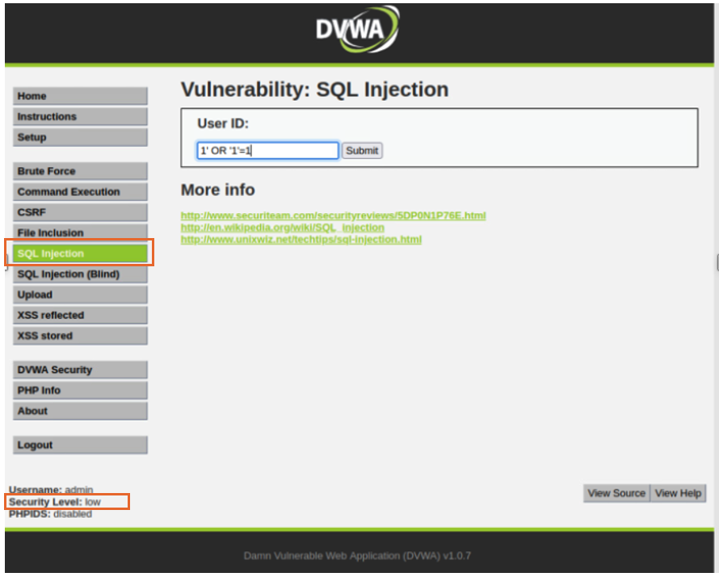
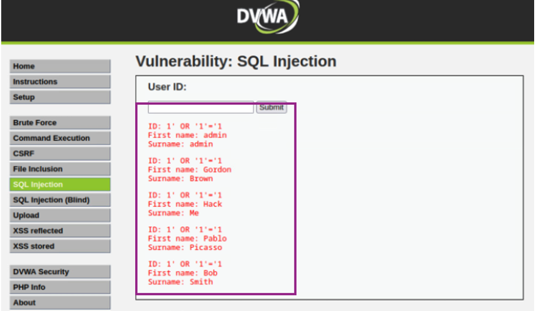

# Milestone 2: DVWA Web Exploitation 

## 1. Overview
This milestone demonstrates practical exploitation of common web application vulnerabilities using the Damn Vulnerable Web Application (DVWA) in a controlled lab environment. Key attack vectors explored include:

- SQL Injection
- Stored Cross-Site Scripting (XSS)
- PHP Webshell Uploads
- Reverse Shells via `msfvenom`

The DVWA security level was configured to Low to simulate real-world scenarios. Tools utilized during this milestone include Kali Linux, the Metasploit Framework, msfvenom, and a web browser for manual testing and validation.

## 2 Environment Setup and Tools

- **Target:** DVWA (v1.0.7)
- **Attacker:** Kali Linux
- **Tools Used:**
  - Web browser
  - Metasploit Framework
  - msfvenom

## 3 Vulnerability Assessment & Exploitation

## 3.1 SQL Injection 

### Test 1: Authentication Bypass

- **Payload Used:**
  ```sql
  1' OR '1'='1
  ```

- **Steps Taken:**
  1. Inject the payload into the User ID field on the SQL Injection module.
  2. Click Submit.

- **Results:**
  - Authentication is bypassed.
  - All user records are exposed.



**Figure 1:** Injection field in DVWA login form


**Figure 2:** Output showing exposed user data


---
### Test 2: Enumeration of Database Name

- **Payload Used:**
  ```sql
  1' UNION SELECT database(), NULL #
  ```

- **Steps Taken:**
  1. Submit the above payload in the SQL Injection input.

- **Results:**
  - The name of the current database is returned.


**Figure 3:** Output showing database name


---

