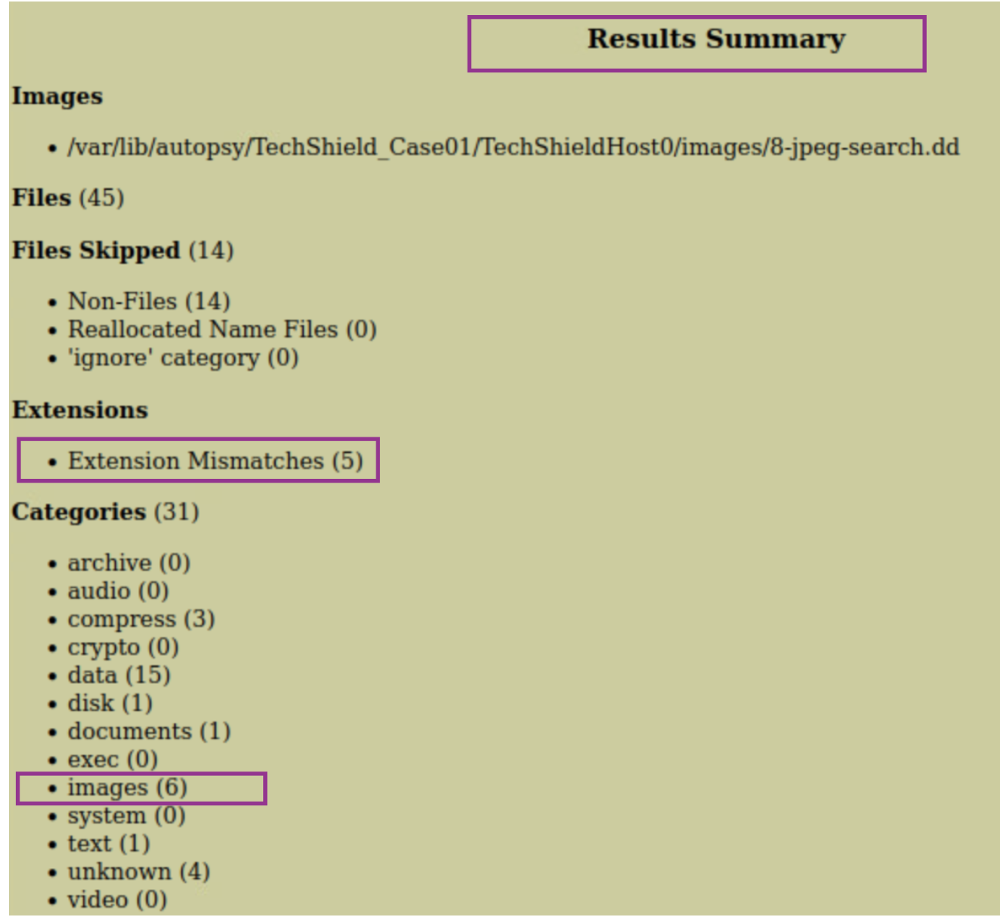

# Milestone 4 – Forensics, Report & Presentation Prep

## 1. Overview
This milestone focuses on performing forensic analysis of a suspicious disk image using Autopsy. Tasks included verifying file integrity with hashing, importing and analyzing the forensic image in Autopsy, identifying hidden images with suspicious file types, examining extension mismatches, and exporting digital evidence. The findings provide insight into potential data concealment tactics and improper file labeling.

## 2. Test Environment Setup 

Component             | Details                                             |
|----------------------|-----------------------------------------------------|
| Forensic Workstation | Kali Linux (Username: kali, Password: kali)        |
| Evidence Source      | 8-jpeg-search.dd (forensic image)                  |
| Tool Used            | Autopsy v2.24 (Digital Forensics Platform)         |

### Tools Used
- `md5sum` (hashing via terminal)
- Autopsy (forensic GUI analysis)
- File Manager (image location/export)
  
---
## 3. Evidence Collection and Analysis

### 3.1 Hashing & Integrity Check

**Objective:** Generate and store an MD5 hash of the forensic image to verify data integrity throughout the investigation.

**Steps Taken:**
1. Generated MD5 hash using `md5sum`:
   ```bash
   md5sum JPEG_Test_Host.dd > image_hash.txt
   ```
2. Saved hash output in the `Hashes/` directory.

**Results:**
- MD5 hash: `deb20836198d94dafdfd921f8e15c7cc`


**Figure 1:** Terminal showing the `md5sum` command and hash saved.


---

### 3.2 Autopsy Case Setup

**Objective:** Create a new case in Autopsy, verify hash, and prepare for forensic examination.

**Steps Taken:**
1. Launch Autopsy and create a new case.
2. Importe the `JPEG_Test_Host.dd` image.
3. Verify the MD5 hash in Autopsy matches the pre-calculated one.

**Results:**
- Case setup was successful.
- Autopsy confirmed the image hash matches: `deb20836198d94dafdfd921f8e15c7cc`


**Figure 2:** Autopsy interface showing case creation.


**Figure 3:** Hash verification screen in Autopsy.

---
### 3.3 Analyze Forensic Image

### Objective
Identify hidden or obfuscated JPEG artifacts via image preview, metadata inspection, and extension mismatch detection.

### Steps Taken
1. Used Autopsy's "Sorter" to filter by "Images" and " Extension Mismatches" category.
2. Visually reviewed thumbnails and metadata.
3. Flagged suspicious files with incorrect extensions or deleted status.
4. Verified content using metadata and previews.

### Results
- 6 JPEG files recovered; 4 had mismatched or suspicious extensions.
- Files flagged:
  - `file2.dat`, `file7.hmm`, `file9.boo`, `file13.dll:here`
  - `file6.jpg` and `file7.hmm` were deleted images
  - `file13.dll:here` used an alternate data stream (ADS)
  
  - Sorter output with extension mismatches (p.9)
  - Metadata confirmation for `file2.dat` (p.10)


**Figure 4:** Sorter output summary showing counts for images and extension mistmaches.


**Figure 5:** Thumbnail preview confirming JPEG content for file2.dat despite .dat extension.


--- 

### 3.4 Identify Suspicious Files – Extension Mismatches

**Objective:** Detect files with misleading extensions.

**Steps Taken:**
- Navigated to the "Extension Mismatch" category in Autopsy.
- Cross-referenced MIME types, metadata, and file previews.
- Verified file type by checking content signature and metadata.

**Results:**
Seven files were flagged. Six were confirmed JPEGs with incorrect extensions. One was a text file mislabeled as a JPG. Two deleted files were fully recovered and verified.

**Figure 4:** Metadata and MIME mismatch for file2.dat

---


